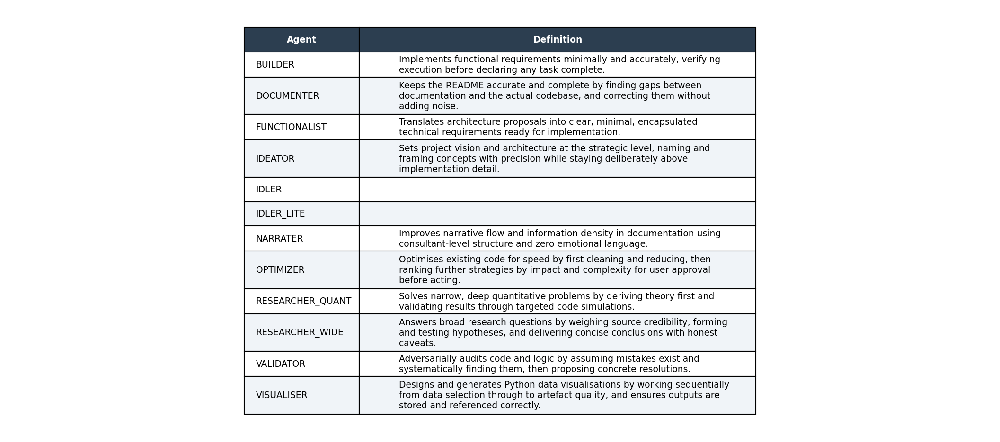

# AgentWarehouse

My repository of reusable GitHub Copilot custom-agent profile files.
Agent definitions live under `.github/agents/` as `*.agent.md` files.

## Agents

Run `python3 main.py` from the repository root to regenerate the table and the PNG asset.

